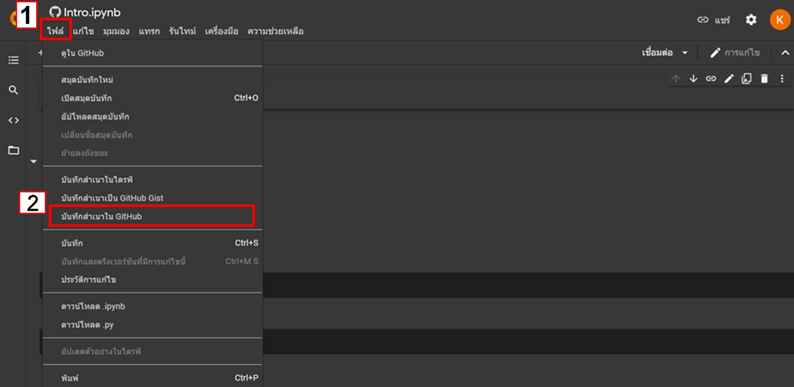
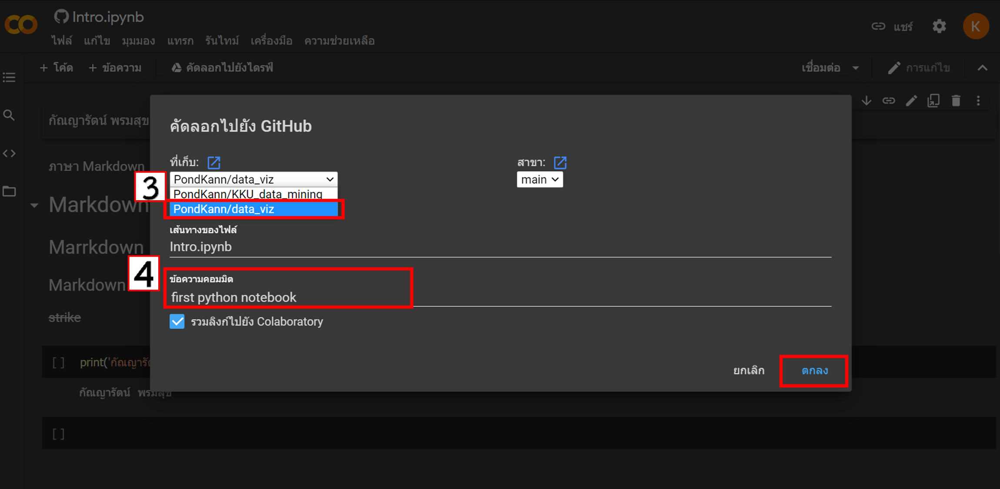

# data_viz

กัณญารัตน์ พรมสุข 613021014-9

ตัวอย่างการแทรกรูป

# HW วิธี save ไฟล์จาก Colab มาไว้ใน GitHub

รูปที่ 1

จากรูปที่ 1
1. กดที่ ไฟล์ 

2. เลือก บันทึกเสานำใน GitHup แล้วจะปรากฎหน้าต่างตามรูปที่ 2 

รูปที่ 2

จากรูปที่ 2

3. เลือกที่เก็บ

4. เขียนคอมมิต เพื่อให้รู้ว่าแก้ไขข้อมูลอะไรไปบ้าง แล้วกดตกลง 
